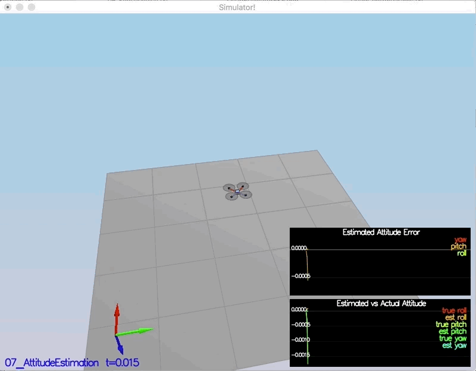
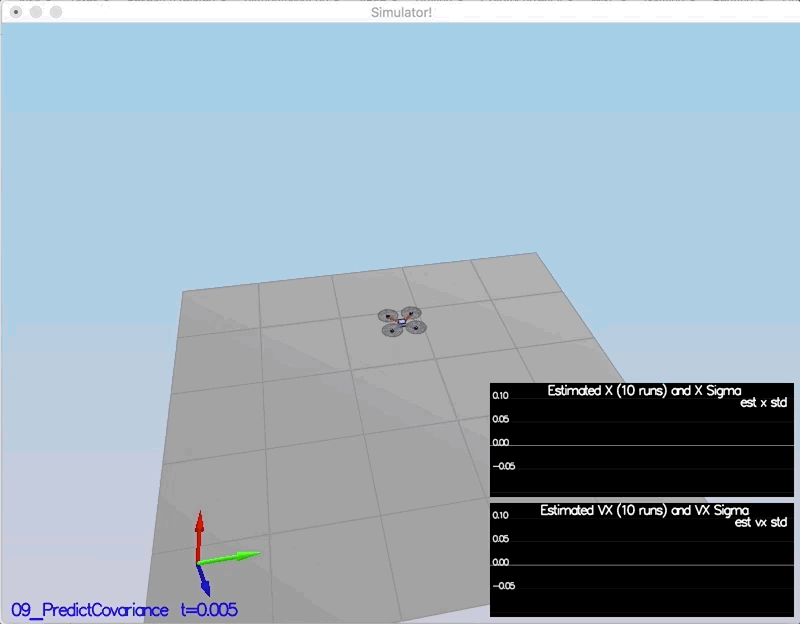

# Estimator Project
## Step 1: Sensor Noise
Simply read in measurements listed in the second column of Graph1.txt/Graph2.txt and take standard deviation, via python I get:
$$
\sigma_{GPSPosXY} \approx 0.7   \\
\sigma_{AccelXY} \approx  0.5
$$

## Step 2: Attitude Estimation
Implementing "Estimation for Quadrotors" eq(43).
$$
\bar{q_t} = dq * q_t
$$
where LHS is the predicted quaternion, $dq$ is the quaternion given by integrated IMU body rates in the body frame, $q_t$ is the quaternion derived from current estimated euler angles.
```c++
Quaternion<float> q = Quaternion<float>::FromEuler123_RPY(rollEst, pitchEst, ekfState(6));
Quaternion<float> q_new = q.IntegrateBodyRate(gyro, dtIMU);
float predictedPitch = q_new.Pitch();
float predictedRoll = q_new.Roll();
ekfState(6) = q_new.Yaw();

// normalize yaw to -pi .. pi
if (ekfState(6) > F_PI) ekfState(6) -= 2.f*F_PI;
if (ekfState(6) < -F_PI) ekfState(6) += 2.f*F_PI;
```
## Step 3: Prediction Step
Implementing eq(49)-(52) of "Estimation for Quadrotors".
```c++
VectorXf QuadEstimatorEKF::PredictState(VectorXf curState, float dt, V3F accel, V3F gyro)
////////////////////////////// BEGIN STUDENT CODE ///////////////////////////
// eq(49) of "Estimation for Quadrotors"
V3F accel_inertial = attitude.Rotate_BtoI(accel);
predictedState(0) += predictedState(3) * dt;
predictedState(1) += predictedState(4) * dt;
predictedState(2) += predictedState(5) * dt;
predictedState(3) += accel_inertial.x * dt;
predictedState(4) += accel_inertial.y * dt;
predictedState(5) += -CONST_GRAVITY * dt + accel_inertial.z * dt;
/////////////////////////////// END STUDENT CODE ////////////////////////////
```
```c++
MatrixXf QuadEstimatorEKF::GetRbgPrime(float roll, float pitch, float yaw)
////////////////////////////// BEGIN STUDENT CODE ///////////////////////////
// eq(52) of "Estimation for Quadrotors"
RbgPrime(0, 0) = -cos(pitch) * sin(yaw);
RbgPrime(1, 0) = cos(pitch) * cos(yaw);
RbgPrime(2, 0) = 0.f;
RbgPrime(0, 1) = -sin(roll) * sin(pitch) * sin(yaw) - cos(roll) * cos(yaw);
RbgPrime(1, 1) = sin(roll) * sin(pitch) * sin(yaw) - cos(roll) * sin(yaw);
RbgPrime(2, 1) = 0.f;
RbgPrime(0, 2) = -cos(roll) * sin(pitch) * sin(yaw) + sin(roll) * cos(yaw);
RbgPrime(1, 2) = cos(roll) * sin(pitch) * cos(yaw) + sin(roll) * sin(yaw);
RbgPrime(2, 2) = 0.f;

/////////////////////////////// END STUDENT CODE ////////////////////////////
```
```c++
void QuadEstimatorEKF::Predict(float dt, V3F accel, V3F gyro)
////////////////////////////// BEGIN STUDENT CODE ///////////////////////////
// eq(51) of "Estimation for Quadrotors"
gPrime(0, 3) = dt;
gPrime(1, 4) = dt;
gPrime(2, 5) = dt;
Mat3x3F RbgP;
for (int i = 0; i < 9; i++) {
    RbgP[i] = RbgPrime(i);
}
gPrime(3, 6) = dt * (RbgP * accel).x;
gPrime(4, 6) = dt * (RbgP * accel).y;
gPrime(5, 6) = dt * (RbgP * accel).z;
ekfCov = gPrime * ekfCov * gPrime.transpose() + Q;
/////////////////////////////// END STUDENT CODE ////////////////////////////
```
## Step 4: Magnetometer Update
Implementing eq(56)-(58) of "Estimation for Quadrotors".
```c++
void QuadEstimatorEKF::UpdateFromMag(float magYaw)
////////////////////////////// BEGIN STUDENT CODE ///////////////////////////
// eq(58)
hPrime(6) = 1.f;
z(0) = fmod(z(0), 2.0 * (float)M_PI);
// eq(57)
zFromX(0) = ekfState(6);
/////////////////////////////// END STUDENT CODE ////////////////////////////
```
## Step 5: Closed Loop + GPS Update
Implementing eq(53)-(55) of "Estimation for Quadrotors".
```c++
void QuadEstimatorEKF::UpdateFromGPS(V3F pos, V3F vel)
////////////////////////////// BEGIN STUDENT CODE ///////////////////////////
// eq(55)
for (int i = 0; i < 6; i++) {
    hPrime(i, i) = 1.f;
}
// eq(54)
for (int j = 0; j < 6; j++) {
    zFromX(j) = ekfState(j);
}
/////////////////////////////// END STUDENT CODE ////////////////////////////
```
```c++
void QuadEstimatorEKF::Update(VectorXf& z, MatrixXf& H, MatrixXf& R, VectorXf& zFromX)
////////////////////////////// BEGIN STUDENT CODE ///////////////////////////
//  Normalize the difference between measured yaw and predicted yaw
MatrixXf diff = z - zFromX;
float angle = diff(0);
angle = fmod(angle, 2.0f * (float)M_PI);

if (angle <= -(float)M_PI) angle += (2.0f * (float)M_PI);
else if (angle > (float)M_PI) angle -= (2.0f * (float)M_PI);
diff(0) = angle;
ekfState += K * diff;
/////////////////////////////// END STUDENT CODE ////////////////////////////
```
# Results
The results for each scenario are shown below, all of which are generated with final `QuadEstimatorEKF.cpp`, `QuadEstimatorEKF.txt`, `QuadControl.cpp`, `QuadControlParams.txt`.
## Scenario 6
<p align=center>

</p>
## Scenario 7
<p align=center>

</p>
## Scenario 8
<p align=center>

</p>
## Scenario 9
<p align=center>

</p>
## Scenario 10
<p align=center>

</p>
## Scenario 11
<p align=center>

</p>
